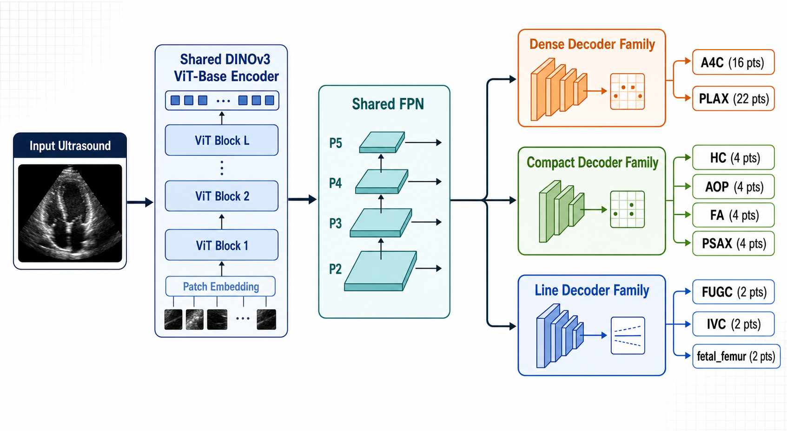

# FUB 2026 Multitask Ultrasound Landmark Regression

ImpactLab's final MICCAI 2026 Fetal Ultrasound Biometry (FUB) challenge
submission. The method uses one shared DINOv3 ViT-B encoder with
task-specific feature pyramids, local adapters, and anatomy-aware landmark
decoders for nine ultrasound tasks.

**Paper:** [Unified Coarse-to-Fine Landmark Localization for Multi-Domain
Ultrasound Biometry](https://openreview.net/search?term=Unified%20Coarse-to-Fine%20Landmark%20Localization%20for%20Multi-Domain%20Ultrasound%20Biometry)
— Hamza Rasaee and Hassan Rivaz, MWM 2026.

## Method

The selected configuration is `hidden_context_local_offset128_v1`:

- `vit_base_patch16_dinov3` shared encoder;
- aspect-preserving 512 × 512 letterbox input;
- one task-specific FPN and context-local adapter per task;
- specialized A4C, HC, IVC, and FUGC geometry heads;
- 128 × 128 heatmaps with learned subpixel offsets for the remaining tasks;
- one EMA checkpoint at inference, with no TTA or model ensemble.



The nine supported task IDs are `A4C`, `AOP`, `FA`, `FUGC`, `HC`, `IVC`,
`PLAX`, `PSAX`, and `fetal_femur`.

## Model weights

The final single-model checkpoint used for the reported CodaBench submission
is available on Hugging Face:

- [fu_bio_2026.pth](https://huggingface.co/hmrasa/FU-Biometry-2026/blob/main/fu_bio_2026.pth)
- SHA-256: `49d1d1478246c7e03468ba8bc3319db6e3aa66170494e9ff19d345865c00f512`

Download it with:

```bash
huggingface-cli download hmrasa/FU-Biometry-2026 fu_bio_2026.pth \
  --local-dir checkpoints
```

## Repository layout

```text
baseline/              Training, model architecture, losses, and evaluation
docker/official/       Final challenge Docker interface
scripts/               Data preparation, training, Docker build, and smoke test
assets/                Method diagrams
submit.py              Landmark inference and submission generation
```

Datasets, checkpoints, predictions, experiment logs, and leaderboard artifacts
are intentionally not included.

## Environment

Python 3.10 or 3.11 is recommended.

```bash
python -m venv .venv
source .venv/bin/activate
python -m pip install --upgrade pip
python -m pip install -r baseline/requirements.txt
```

## Prepare the challenge data

Download the official challenge archive separately, then normalize it into the
layout expected by the training code:

```bash
python scripts/prepare_fu_biometry_dataset.py \
  --raw-root /path/to/extracted/challenge-data \
  --output-root data

python scripts/audit_challenge_dataset.py
```

The preparation script uses organizer-corrected annotations when provided and
converts task-specific landmark columns to the common schema. The dataset is
not redistributed by this repository.

## Train the final model

```bash
bash scripts/train_hidden_context_offset128_v1.sh \
  output/runs/fub2026_offset128_seed42 \
  /path/to/initialization_checkpoint.pth \
  42
```

This runs `baseline/train.py` with AdamW (`2e-5`), cosine annealing, mixed
precision, EMA decay `0.999`, grouped validation, and early stopping. The
initialization checkpoint is not included.

## Generate predictions

```bash
python submit.py \
  --manifest data/manifests/validation_manifest.csv \
  --checkpoint-path /path/to/best_model.pth \
  --output-dir submission_output \
  --encoder-weights none
```

The command writes `regression_predictions.json` and `submission.zip`.
Coordinates are restored from letterboxed model space to original-image pixel
space and checked for duplicate or missing task-image keys.

## Build the official Docker image

```bash
bash scripts/build_official_docker_submission.sh \
  impactlab/fub2026-final:v1 \
  /path/to/best_model.pth
```

The build script creates a temporary minimal context, bundles the supplied
checkpoint, and writes the CodaBench package under `output/docker_submissions/`.
Docker inference is offline and loads the bundled checkpoint directly.

## Final reported system

- CodaBench submission: `874632 / 874632_FUB`
- Official final-test score: `23.29` (lower is better)
- Single bundled checkpoint
- No route-wise checkpoint selection, model averaging, manual corrections,
  static test predictions, or hidden-test feedback

## Principal implementation files

- `baseline/model_factory.py` — FPNs, adapters, and decoder heads;
- `baseline/model_profiles.py` — final named configuration;
- `baseline/train.py` — losses, optimization, EMA, splitting, and selection;
- `baseline/dataset.py` and `baseline/utils.py` — preprocessing and geometry;
- `submit.py` — inference, decoding, coordinate restoration, and output checks.

## License

The original code in this repository is released under the
[MIT License](LICENSE). DINOv3 weights, challenge data, and other third-party
resources remain subject to their respective upstream licenses and access
terms.

## Citation

If you use this code, please cite:

> Rasaee, H., & Rivaz, H. (2026). **Unified Coarse-to-Fine Landmark
> Localization for Multi-Domain Ultrasound Biometry.** MWM 2026.

```bibtex
@inproceedings{rasaee2026unified,
  title     = {Unified Coarse-to-Fine Landmark Localization for Multi-Domain
               Ultrasound Biometry},
  author    = {Rasaee, Hamza and Rivaz, Hassan},
  booktitle = {MWM 2026},
  year      = {2026}
}
```
