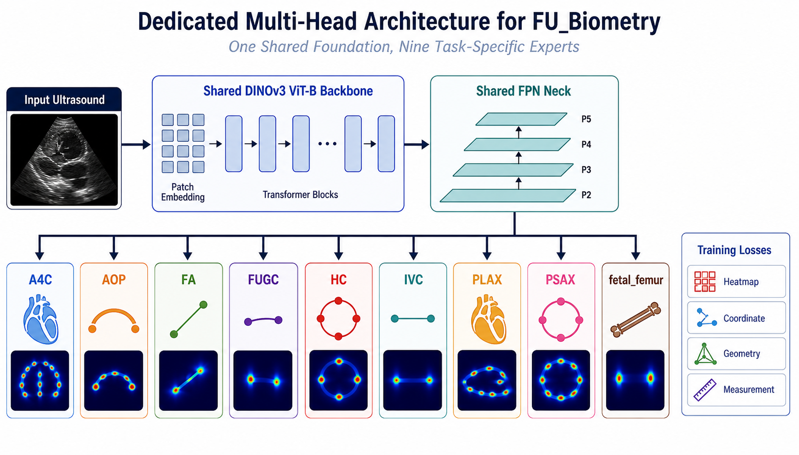

# Dedicated-Head FU_Biometry

This document describes the dedicated-head model family built for this repository after moving away from a single generic decoder design.

The goal of this branch is simple:

- keep one shared ultrasound foundation backbone
- keep one shared feature neck
- specialize the decoder per dataset/task anatomy
- train and validate with losses that better match each task geometry

## Architecture Figure



The figure is conceptual. The exact implementation is defined by the code in [baseline/model_factory.py](baseline/model_factory.py), [baseline/train.py](baseline/train.py), [baseline/utils.py](baseline/utils.py), and [submit.py](submit.py).

## Why This Exists

The earlier model families used one decoder family for several tasks. That was practical, but not ideal for this challenge because the datasets are very different:

- `A4C` and `PLAX` are dense multi-landmark cardiac structure tasks.
- `HC` and `PSAX` are compact ring-like tasks.
- `AOP` and `FA` are compact but geometry-specific tasks.
- `IVC`, `FUGC`, and `fetal_femur` are 2-point tasks, but not the same kind of 2-point task.

That means a single shared decoder shape is too weak for some tasks and too generic for others.

## Current Model Design

The dedicated-head setup keeps:

- one shared `DINOv3 ViT-B` encoder
- one shared `FPN` neck
- one task-specific decoder head per challenge dataset

High-level flow:

1. input ultrasound image is letterboxed to a square input
2. shared `DINOv3` encoder extracts global features
3. shared `FPN` builds multi-scale features
4. task-specific decoder head predicts landmark heatmaps
5. some tasks also produce auxiliary outputs used only during training

## Dedicated Decoder Map

The `dedicated_v1` decoder profile currently maps tasks like this:

| Task | Decoder | Reason |
| --- | --- | --- |
| `A4C` | `a4c` | chamber-aware dense cardiac layout |
| `AOP` | `aop` | compact arc-like anatomy |
| `FA` | `fa` | axis-aware fetal abdomen geometry |
| `FUGC` | `fugc` | local 2-point segment with auxiliary short-segment branch |
| `HC` | `hc` | ring-aware head circumference structure |
| `IVC` | `ivc` | noisy short local vessel diameter |
| `PLAX` | `plax` | long-axis dense cardiac structure |
| `PSAX` | `psax` | short-axis compact ring with paired diameters |
| `fetal_femur` | `femur` | shaft-aware long bone endpoints with auxiliary shaft branch |

Code anchor:

- decoder profile preset: [baseline/model_factory.py](baseline/model_factory.py)

## Weak-Task Decoder Map

The `weak_tasks_v1` decoder profile is the current targeted experiment preset. It only specializes the weak tasks and leaves the stronger tasks on the proven default path.

| Task | Decoder | Reason |
| --- | --- | --- |
| `FUGC` | `fugc` | short 2-point structure that benefits from local refinement and segment evidence |
| `IVC` | `ivc` | noisy vessel diameter with directional context and endpoint pairing |
| `fetal_femur` | `femur` | long-bone endpoint task that benefits from shaft-aware evidence |

Why this preset exists:

- the full `dedicated_v1` profile changed too many tasks at once
- it improved some weak tasks but often regressed already-stable tasks
- `weak_tasks_v1` keeps the selective specialization where it is most likely to help leaderboard rank

## Why Each Head Was Chosen

The dedicated heads were not chosen by landmark count alone. They were chosen from the actual image appearance, anatomical structure, and measurement geometry of each dataset.

### `A4C` -> `A4CHeatmapHead`

Why:

- `A4C` is a 16-point four-chamber cardiac view with landmarks spread across a large global structure.
- The task depends on chamber layout, valve positions, and long boundaries, not just local point appearance.
- A small generic decoder tends to underuse the global relationship between the chambers.

Design choice:

- a heavier decoder
- multi-dilation context branches
- stronger global chamber-aware refinement

Intent:

- preserve large-scale cardiac structure while still resolving local landmark peaks

### `AOP` -> `AOPHeatmapHead`

Why:

- `AOP` is compact, but the anatomy is curved and arc-like rather than circular or rectangular.
- The important structure is a bright curved contour with nearby shadow and lumen patterns.
- A generic compact head does not explicitly bias toward arc geometry.

Design choice:

- lightweight custom decoder
- horizontal, vertical, and dilated arc-sensitive branches

Intent:

- help the model lock onto curved compact anatomy without over-parameterizing a small task

### `FA` -> `FAHeatmapHead`

Why:

- `FA` is a 4-point fetal abdomen task with strong axis structure.
- The landmarks define measurement axes more than arbitrary contour points.
- The anatomy is compact, but directional geometry matters.

Design choice:

- medium-width custom decoder
- explicit horizontal and vertical axis-sensitive filters

Intent:

- improve axis consistency and pair geometry for abdomen measurements

### `FUGC` -> `FUGCHeatmapHead`

Why:

- `FUGC` is only 2 points, but it is not a long line task.
- It is a small local structure where short-range detail matters more than global shape.
- The useful supervision is the short connecting segment, not a full elongated shaft.

Design choice:

- local-refinement decoder
- auxiliary short-segment branch used during training

Intent:

- sharpen local endpoint placement and stabilize the short measured segment

### `HC` -> `HCHeatmapHead`

Why:

- `HC` is a compact head view with a bright ring-like skull contour.
- The landmarks are constrained by circular or elliptical boundary structure.
- A generic compact head can find points, but it does not explicitly reinforce ring continuity.

Design choice:

- heavy custom decoder
- multi-dilation ring-aware context branches

Intent:

- improve consistency around the skull boundary rather than treating each point independently

### `IVC` -> `IVCHeatmapHead`

Why:

- `IVC` is a short 2-point vessel diameter task in noisy cardiac ultrasound.
- The diameter segment is often short, oblique, low-contrast, and surrounded by clutter.
- It is not a femur-like shaft and not a clean long segment.

Design choice:

- compact dedicated decoder
- directional horizontal, vertical, and diagonal context branches
- local diameter-aware refinement

Intent:

- make the model sensitive to short oblique vessel diameter geometry in noisy frames

### `PLAX` -> `PLAXHeatmapHead`

Why:

- `PLAX` is a dense 22-point long-axis cardiac task with multiple vertically paired measurements.
- The anatomy spans a large field of view and depends heavily on long-axis organization.
- A generic dense decoder is not specific enough for this structured cardiac layout.

Design choice:

- heavy long-axis decoder
- horizontal, vertical, and dilated context fusion
- more capacity than the generic dense head

Intent:

- preserve global long-axis organization while keeping dense landmark prediction stable

### `PSAX` -> `PSAXHeatmapHead`

Why:

- `PSAX` is a compact short-axis cardiac view with a ring-like central structure.
- The four landmarks form paired diameters around a localized circular target.
- It behaves more like a short-axis ring task than a generic compact point task.

Design choice:

- medium custom decoder
- ring-aware multi-dilation context
- extra local mixing to support diagonal paired diameters

Intent:

- improve localization on compact circular anatomy with short-axis pair structure

### `fetal_femur` -> `FemurHeatmapHead`

Why:

- `fetal_femur` is a 2-point long bone task with strong shaft structure.
- The main ambiguity is often endpoint placement along a bright elongated bone.
- The shaft itself is useful supervision and should not be discarded during training.

Design choice:

- heavier dedicated decoder
- axial context branches
- auxiliary shaft branch used during training

Intent:

- teach the model the entire bone axis so endpoint prediction becomes more stable

## Head Sizing Profile

The repository also supports task-specific head width scaling through `challenge_v1`.

Current sizing intent:

- `heavy`: `A4C`, `HC`, `PLAX`, `fetal_femur`
- `light`: `AOP`, `FUGC`, `IVC`
- `medium`: `FA`, `PSAX`

This is applied on top of the decoder family choice. So two tasks can both use custom decoders while still having different channel budgets.

## Loss Design

The training objective is not just one loss for all datasets.

Base losses:

- heatmap loss
- coordinate loss

Optional challenge-oriented losses:

- measurement loss
- dataset-family geometry loss

Task-specific auxiliary losses:

- `fetal_femur`: shaft mask loss
- `FUGC`: short segment mask loss

The dataset-family profile currently available is `dataset_v1`:

- `dense`: `A4C`, `PLAX`
- `compact`: `HC`, `AOP`, `FA`, `PSAX`
- `line`: `FUGC`, `IVC`, `fetal_femur`

This is implemented in [baseline/utils.py](baseline/utils.py).

Important:

- the intended dedicated-head experiment must use `--task-loss-family-profile dataset_v1`
- an earlier run named `dinov3_vitb_dedicated_head` used `dedicated_v1` but still had `task loss family profile: uniform`
- the correct dataset-family-loss run should be stored separately as `dinov3_vitb_dedicated_head_datasetv1`

## Challenge Metric Alignment

The official challenge ranking is based on:

- `50%` normalized landmark `MRE`
- `50%` normalized measurement error

This repo now supports validation reporting for:

- raw `MRE`
- raw measurement `MAE`
- normalized `MRE`
- normalized measurement `MAE`
- combined score

Important:

- the code is now closer to the challenge metric than the original baseline
- it is still a training approximation, not the organizer's hidden final evaluation code

## Main Training Arguments

The dedicated-head workflow depends mainly on these flags:

- `--fpn-mode`
- `--task-head-profile`
- `--task-decoder-profile`
- `--task-loss-family-profile`
- `--dataset-loss-weight`
- `--measurement-loss-weight`
- `--femur-shaft-loss-weight`
- `--fugc-segment-loss-weight`

See the parser in [baseline/train.py](baseline/train.py).

## Recommended Training Command

```bash
conda activate miccai_fu_biometry

python baseline/train.py \
  --epochs 2000 \
  --early-stopping-patience 10 \
  --batch-size 4 \
  --num-workers 4 \
  --fpn-mode task_specific \
  --task-head-profile challenge_v1 \
  --task-decoder-profile weak_tasks_v1 \
  --task-loss-family-profile dataset_v1 \
  --measurement-loss-weight 0.0 \
  --dataset-loss-weight 0.02 \
  --femur-shaft-loss-weight 0.15 \
  --fugc-segment-loss-weight 0.08 \
  --output-dir output/runs/dinov3_vitb_taskfpn_weaktasks_v1
```

## Local Inference

```bash
conda activate miccai_fu_biometry

python baseline/model.py \
  --data-root data \
  --checkpoint-path output/runs/dinov3_vitb_taskfpn_weaktasks_v1/checkpoints/best_model.pth \
  --output-dir output/runs/dinov3_vitb_taskfpn_weaktasks_v1/predictions \
  --fpn-mode task_specific
```

## Local Evaluation

```bash
conda activate miccai_fu_biometry

python baseline/evaluate.py \
  --data-root data \
  --pred-root output/runs/dinov3_vitb_taskfpn_weaktasks_v1/predictions \
  --output-file output/runs/dinov3_vitb_taskfpn_weaktasks_v1/evaluation_results.json \
  --summary-file output/runs/dinov3_vitb_taskfpn_weaktasks_v1/evaluation_summary.txt
```

## Challenge Submission

`submit.py` can infer most model settings from checkpoint metadata. The important part is that the checkpoint must have been trained with the dedicated-head configuration.

```bash
conda activate miccai_fu_biometry

python submit.py \
  --checkpoint-path output/runs/dinov3_vitb_dedicated_head_datasetv1/checkpoints/best_model.pth \
  --output-dir output/submissions/dinov3_vitb_dedicated_head_datasetv1 \
  --batch-size 8 \
  --num-workers 4
```

If you want to override manually, `submit.py` also supports:

- `--fpn-mode`
- `--task-head-profile`
- `--task-decoder-profile`
- `--encoder-name`
- `--head-type`
- `--input-size`

## What Changed Compared With Earlier Runs

Earlier strong runs in this repo relied on:

- shared decoder families
- shared or task-specific FPN experiments
- weaker challenge-metric alignment

The dedicated-head branch adds:

- dataset-specific decoder design
- more anatomy-specific inductive bias
- auxiliary supervision for `FUGC` and `fetal_femur`
- challenge-oriented normalized validation reporting

## What To Tune Next

If this model still underperforms on the leaderboard, the next practical levers are:

1. increase `--dataset-loss-weight` carefully
2. try `--measurement-loss-weight` above zero in small controlled runs
3. compare `shared` vs `task_specific` FPN again after dedicated heads
4. add more task-specific auxiliary branches only for the weakest public leaderboard tasks
5. compare `512` vs larger input size if memory allows

## Files To Read

- architecture factory: [baseline/model_factory.py](baseline/model_factory.py)
- training loop: [baseline/train.py](baseline/train.py)
- losses and evaluation utilities: [baseline/utils.py](baseline/utils.py)
- inference script: [baseline/model.py](baseline/model.py)
- submission builder: [submit.py](submit.py)

## Asset Used In This Document

- image: [assets/fu_biometry_dedicated_heads_architecture.png](assets/fu_biometry_dedicated_heads_architecture.png)
